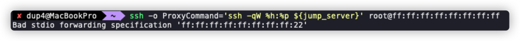
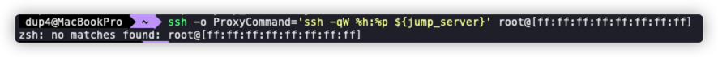

# A problem about SSH, ZSH, Proxy and IPv6

## Write in front

众所周知，要想进入某个高校的服务器，一般没那么简单。

一般来说，高校的信息化中心会给你一个跳板机的地址，譬如 `jump.edu.cn`。

那么你只需要先 ssh 进入跳板机，然后就可以通过这台机器 ssh 到你想要进入的校内服务器。

但是这样做，有一些问题：

* 每次登录到指定服务器至少需要两步，先 ssh 进跳板机，再 ssh 到指定机器，无法通过一条命令完成。
* session 的驻留时间受到跳板机配置的限制。
* 要想从服务器中将文件复制出来很不方便。

那以上的几个问题，对于我来说，实在是不能容忍，那么必然要另辟蹊径。

## Problems And Solution

但实际上上述几个问题，在 ssh 面前，完全是小菜一碟。

我们只需要使用 ProxyCommand 即可：

```bash
# login to the target server
ssh -o ProxyCommand="ssh -qW %h:%p ${jump_server}" "${target_server}"

# copy files from target server
scp -o ProxyCommand="ssh -qW %h:%p ${jump_server}" ${source_file} ${destination_file}
```

在 IPv4 时代，这样做没有任何问题，我们相处的十分和谐。

有一天，学校采购了一批机器，但是没有 IPv4 的地址能够分配给它们了，所以只能够给它们分配 IPv6 的地址，所以我需要通过 IPv6 登录进这些服务器。

那么我依样画葫芦，直接在 `${target_server}` 处填上 `username@ipv6-addr`，



直接给我来了一行报错，那么我猜想，地址的尾部多了 `:22`，是不是 port 和 addr 混在一起无法识别，需要给 `addr` 加上 `[]` 了？



又是一行报错。

这有一点奇怪子，没有什么思路，只能先问问 chatGPT；


OK，那我们用双引号括起来：

```bash
ssh -o ProxyCommand='ssh -qW "%h":%p ${jump_server}' root@"[ff:ff:ff:ff:ff:ff:ff:ff]"
```

然后我们就能成功进入服务器了，如果想少打一点字符，换成这种形式也可：

```bash
ssh -o ProxyCommand='ssh -qW "[%h]":%p ${jump_server}' root@ff:ff:ff:ff:ff:ff:ff:ff
```

同理，对于 scp，只需要相应的变换一下：

```bash
scp -o ProxyCommand='ssh -qW "[%h]":%p ${jump_server}' ${source_file} ${destination_file}
```

后来我发现，其实还有一个选项，我们可以使用 ProxyJump，而在 ssh 中，对应 `-J` 参数：

```plain
    -J destination
            Connect to the target host by first making a ssh connection to the jump host described by destination and then establishing a TCP forwarding to the ultimate destination from there.  Multiple
            jump hops may be specified separated by comma characters.  This is a shortcut to specify a ProxyJump configuration directive.  Note that configuration directives supplied on the command-line
            generally apply to the destination host and not any specified jump hosts.  Use ~/.ssh/config to specify configuration for jump hosts.
```

所以对应的命令如下：

```bash
# login to the target server
ssh -J "${jump_server}" "${target_server}"

# copy files from target server
scp -J "${jump_server}" ${source_file} ${destination_file}
```

非常的简单，而且对于 v4, v6 通吃。
